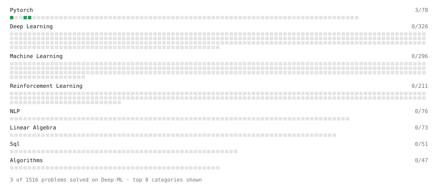

# Deep-ML

My machine learning practice from [Deep-ML](https://www.deep-ml.com). Every solution here was written by hand.

**2** solved · 2 problems · 0 labs · 0 math

[**Browse the interactive portfolio**](https://AkbarBunyad.github.io/deep-ml/) to replay this filling in over time.

## Problems

| | Difficulty | Solved | |
| --- | --- | --- | --- |
| [Create a Float Tensor from a Python List](https://www.deep-ml.com/problems/880) | easy | 2026-10-02 | [solution](problems/0880-create-a-float-tensor-from-a-python-list) |
| [Implement a Linear Layer Forward Pass with Matrix Multiplication](https://www.deep-ml.com/problems/883) | easy | 2026-10-02 | [solution](problems/0883-implement-a-linear-layer-forward-pass-with-matrix-multiplication) |

---

_This file is regenerated by Deep-ML on every push._
